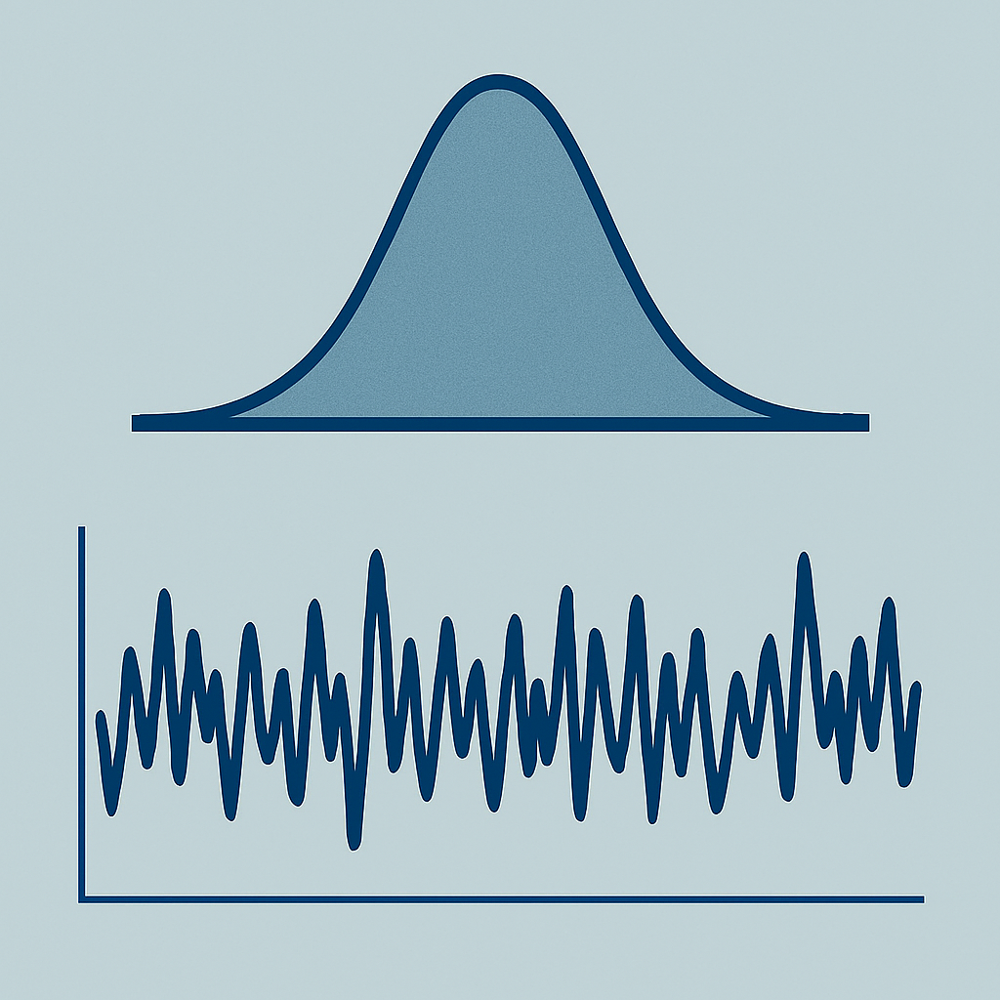

# Bayesian Monte Carlo Markov Chain modelling Cookbook



[](https://github.com/ProjectPythia/cookbook-template/actions/workflows/nightly-build.yaml)
[](https://binder.projectpythia.org/v2/gh/ProjectPythia/cookbook-template/main?labpath=notebooks)
[](https://zenodo.org/badge/latestdoi/475509405)

_See the [Cookbook Contributor's Guide](https://projectpythia.org/cookbook-guide) for step-by-step instructions on how to create your new Cookbook and get it hosted on the [Pythia Cookbook Gallery](https://cookbooks.projectpythia.org)!_

This Project Pythia Cookbook covers ... (replace `...` with the main subject of your cookbook ... e.g., _working with radar data in Python_)

## Motivation

While there are many dedicated packages to perform Bayesian estimation, it might be very useful to understand what's under the hood, so scientists and students are increasingly knowledgeable and empowered to make the best modelling decisions. This cookbook is an effort to demonstrate how Monte Carlo Markov Chain (MCMC) algorithms play a role in Bayesian estimation. I have included several applications of this algorithm to different models - starting from estimating basic normal distribution parameters and regressions, all the way to more complex population dynamics models.

## Authors

[Matheus de Barros](https://github.com/matheusbarrosb)

### Background

#### Bayes' rule and probability statements

In Bayesian models, the goal is to estimate the *joint posterior distribution* given a prior distribution $p(\theta)$ (what we already know about the data), and the *likelihoood* $p(y|\theta)$ (the probability of observing the data $y$ at given $\theta$ values). Before I introduce you to the MCMC algorithm, let's review some basics of probability and the Bayes' rule.

To estimate model parameters $\theta$ given the data $y$, we need to specify the *joint probability distribution*:

In Bayesian models, the goal is to estimate the *posterior distribution* given a prior distribution $p(\theta)$ (what we already know about the parameters), and the *likelihood* $p(y|\theta)$ (the probability of observing the data $y$ given parameter values $\theta$). Before introducing the MCMC algorithm, let's review some basics of probability and Bayes' rule.

To estimate model parameters $\theta$ given the data $y$, we need to specify the *joint probability distribution* of the data and parameters:
$$
p(y, \theta) = p(y|\theta)p(\theta)
$$
Applying Bayes' rule and conditional probability statements, we obtain the posterior:
$$
p(\theta|y) = \frac{p(y|\theta)p(\theta)}{p(y)}
$$
where $p(y) = \int p(y|\theta)p(\theta)d\theta$ is the marginal likelihood, a normalizing constant. The marginal likelihood is the sum of all possible values of $\theta$ given the observed data.

The *unnormalized posterior can be given by* $p(\theta|y) \propto p(\theta)p(y|\theta)$

#### The Metropolis-Hastings Monte Carlo Markov Chain algorithm

### The Metropolis-Hastings Algorithm

The **Metropolis-Hastings (MH) algorithm** is a MCMC method used to generate samples from a probability distribution when direct sampling is difficult due to not having an analytical solution. The Metropolis-Hastings algorithm is particularly useful for sampling from complex posteriors.

#### Steps of the Algorithm

1. **Initialization:**  
   Start with an initial value for the parameter(s) of interest, denoted as $\theta^{(0)}$.

2. **Proposal:**  
   At iteration $t$, propose a new value $\theta^*$ from a proposal distribution $q(\theta^* | \theta^{(t-1)})$. This distribution is often chosen to be easy to sample from, such as a normal distribution centered at the current value (at iteration $t-1$).

3. **Acceptance Ratio:**

   This defines whether sampled values from the proposal distribution will be accepted or not:
  
   Compute the acceptance probability $\alpha$:
   $$
   \alpha = \min\left(1, \frac{p(\theta^*)q(\theta^{(t-1)}|\theta^*)}{p(\theta^{(t-1)})q(\theta^*|\theta^{(t-1)})}\right)
   $$

4. **Accept or Reject:**  
   Draw $u \sim \text{Uniform}(0,1)$.  
   - If $u < \alpha$, accept the proposal: set $\theta^{(t)} = \theta^*$.  
   - Otherwise, reject the proposal and set $\theta^{(t)} = \theta^{(t-1)}$.

5. **Iterate:**  
   Repeat steps 2–4 for as many iterations as needed to construct a Markov chain of parameter samples.

#### Key Properties

- The sequence $\{\theta^{(t)}\}$ forms a Markov chain whose stationary distribution is the target distribution $p(\theta)$.
- The algorithm only requires the target distribution to be known up to a normalizing constant.
- After discarding an initial "burn-in" period, the remaining samples can be used to make inferences on parameter posterior distributions.

## Running the Notebooks

You can either run the notebook using [Binder](https://binder.projectpythia.org/) or on your local machine.

### Running on Binder

The simplest way to interact with a Jupyter Notebook is through
[Binder](https://binder.projectpythia.org/), which enables the execution of a
[Jupyter Book](https://jupyterbook.org) in the cloud. The details of how this works are not
important for now. All you need to know is how to launch a Pythia
Cookbooks chapter via Binder. Simply navigate your mouse to
the top right corner of the book chapter you are viewing and click
on the rocket ship icon, (see figure below), and be sure to select
“launch Binder”. After a moment you should be presented with a
notebook that you can interact with. I.e. you’ll be able to execute
and even change the example programs. You’ll see that the code cells
have no output at first, until you execute them by pressing
{kbd}`Shift`\+{kbd}`Enter`. Complete details on how to interact with
a live Jupyter notebook are described in [Getting Started with
Jupyter](https://foundations.projectpythia.org/foundations/getting-started-jupyter).

Note, not all Cookbook chapters are executable. If you do not see
the rocket ship icon, such as on this page, you are not viewing an
executable book chapter.


### Running on Your Own Machine

If you are interested in running this material locally on your computer, you will need to follow this workflow:

(Replace "cookbook-example" with the title of your cookbooks)

1. Clone the `https://github.com/ProjectPythia/cookbook-example` repository:

   ```bash
    git clone https://github.com/ProjectPythia/cookbook-example.git
   ```

1. Move into the `cookbook-example` directory
   ```bash
   cd cookbook-example
   ```
1. Create and activate your conda environment from the `environment.yml` file
   ```bash
   conda env create -f environment.yml
   conda activate cookbook-example
   ```
1. Move into the `notebooks` directory and start up Jupyterlab
   ```bash
   cd notebooks/
   jupyter lab
   ```
